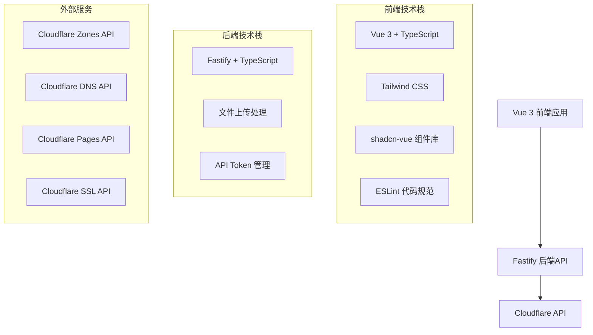
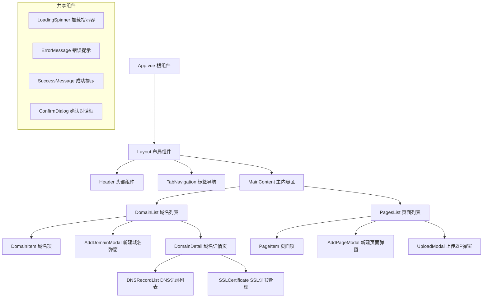
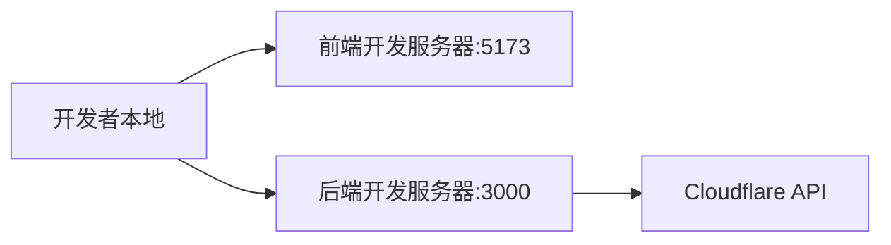
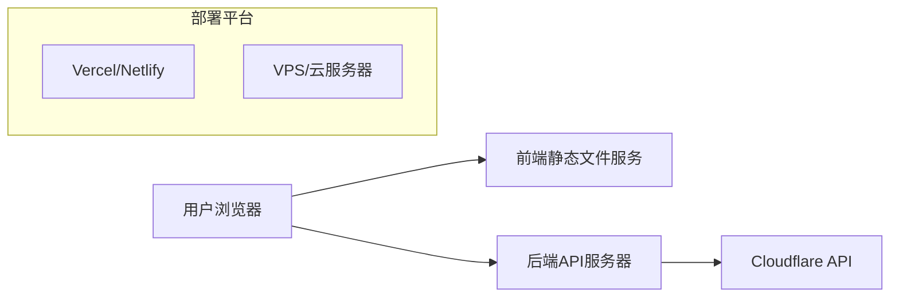

# 设计文档

## 概述

本设计文档基于需求文档，详细描述了Cloudflare静态网页部署应用的技术架构、组件设计和实现方案。应用采用前后端分离架构，前端使用Vue 3生态系统，后端使用Fastify框架，通过RESTful API进行通信。

## 架构

### 整体架构



### 系统架构原则

1. **前后端分离**: 前端专注于用户界面，后端处理业务逻辑和外部API调用
2. **API中间层**: 后端作为Cloudflare API的代理层，提供统一的接口
3. **状态管理**: 前端使用Vue 3的响应式系统管理应用状态
4. **错误处理**: 统一的错误处理机制和用户反馈
5. **安全性**: API Token在后端管理，前端不直接接触敏感信息

## 组件和接口

### 前端组件架构



### 后端API接口设计

#### 域名管理API

```typescript
// 获取域名列表
GET /api/domains
Response: {
  success: boolean;
  data: Domain[];
  message?: string;
}

// 添加新域名
POST /api/domains
Body: {
  name: string;
  nameservers?: string[];
}
Response: {
  success: boolean;
  data?: Domain;
  message?: string;
}

// 获取域名详情
GET /api/domains/:id
Response: {
  success: boolean;
  data?: DomainDetail;
  message?: string;
}

// 获取DNS记录
GET /api/domains/:id/dns-records
Response: {
  success: boolean;
  data?: DNSRecord[];
  message?: string;
}

// 更新DNS记录
PUT /api/domains/:id/dns-records/:recordId
Body: {
  type: string;
  name: string;
  content: string;
  ttl?: number;
}

// 申请SSL证书
POST /api/domains/:id/ssl-certificate
Response: {
  success: boolean;
  data?: SSLCertificate;
  message?: string;
}
```

#### 页面管理API

```typescript
// 获取页面列表
GET /api/pages
Response: {
  success: boolean;
  data: Page[];
  message?: string;
}

// 创建新页面项目
POST /api/pages
Body: {
  name: string;
}
Response: {
  success: boolean;
  data?: Page;
  message?: string;
}

// 上传ZIP文件部署
POST /api/pages/:id/deploy
Body: FormData with zip file
Response: {
  success: boolean;
  data?: DeploymentResult;
  message?: string;
}

// 获取部署状态
GET /api/pages/:id/deployment-status
Response: {
  success: boolean;
  data?: DeploymentStatus;
  message?: string;
}
```

## 数据模型

### 前端数据模型

```typescript
// 域名模型
interface Domain {
  id: string;
  name: string;
  status: 'active' | 'pending' | 'moved' | 'deleted';
  nameservers: string[];
  createdAt: string;
  modifiedAt: string;
}

// 域名详情模型
interface DomainDetail extends Domain {
  dnsRecords: DNSRecord[];
  sslCertificate?: SSLCertificate;
}

// DNS记录模型
interface DNSRecord {
  id: string;
  type: 'A' | 'AAAA' | 'CNAME' | 'MX' | 'TXT' | 'NS';
  name: string;
  content: string;
  ttl: number;
  proxied?: boolean;
}

// SSL证书模型
interface SSLCertificate {
  id: string;
  status: 'active' | 'pending' | 'expired';
  issuer: string;
  expiresAt: string;
}

// 页面模型
interface Page {
  id: string;
  name: string;
  status: 'created' | 'deploying' | 'deployed' | 'failed';
  url?: string;
  deploymentId?: string;
  createdAt: string;
  lastDeployedAt?: string;
}

// 部署结果模型
interface DeploymentResult {
  id: string;
  status: 'queued' | 'building' | 'deploying' | 'success' | 'failure';
  url?: string;
  errorMessage?: string;
}

// 部署状态模型
interface DeploymentStatus {
  status: 'queued' | 'building' | 'deploying' | 'success' | 'failure';
  progress?: number;
  logs?: string[];
  url?: string;
  errorMessage?: string;
}
```

### API响应格式

```typescript
// API响应统一格式
interface ApiResponse<T = any> {
  success: boolean;
  data?: T;
  message?: string;
  error?: {
    code: string;
    details?: any;
  };
}
```

## 错误处理

### 错误分类和处理策略

```typescript
// 错误类型定义
enum ErrorType {
  NETWORK_ERROR = 'NETWORK_ERROR',
  VALIDATION_ERROR = 'VALIDATION_ERROR',
  CLOUDFLARE_API_ERROR = 'CLOUDFLARE_API_ERROR',
  FILE_UPLOAD_ERROR = 'FILE_UPLOAD_ERROR',
  AUTHENTICATION_ERROR = 'AUTHENTICATION_ERROR',
  SERVER_ERROR = 'SERVER_ERROR'
}

// 错误处理器
class ErrorHandler {
  static handle(error: any): UserFriendlyError {
    switch (error.type) {
      case ErrorType.NETWORK_ERROR:
        return {
          title: '网络连接错误',
          message: '请检查网络连接后重试',
          action: 'retry'
        };
      case ErrorType.CLOUDFLARE_API_ERROR:
        return {
          title: 'Cloudflare服务错误',
          message: error.message || '服务暂时不可用，请稍后重试',
          action: 'retry'
        };
      case ErrorType.FILE_UPLOAD_ERROR:
        return {
          title: '文件上传失败',
          message: '请检查文件格式和大小（需小于10MB）',
          action: 'retry'
        };
      default:
        return {
          title: '操作失败',
          message: '发生未知错误，请重试',
          action: 'retry'
        };
    }
  }
}
```

### 全局Loading管理

```typescript
// Loading状态管理
class LoadingManager {
  private static instance: LoadingManager;
  private loadingCount = 0;
  private callbacks: Set<(loading: boolean) => void> = new Set();

  static getInstance(): LoadingManager {
    if (!LoadingManager.instance) {
      LoadingManager.instance = new LoadingManager();
    }
    return LoadingManager.instance;
  }

  startLoading(): void {
    this.loadingCount++;
    this.notifyCallbacks(true);
  }

  stopLoading(): void {
    this.loadingCount = Math.max(0, this.loadingCount - 1);
    if (this.loadingCount === 0) {
      this.notifyCallbacks(false);
    }
  }

  subscribe(callback: (loading: boolean) => void): () => void {
    this.callbacks.add(callback);
    return () => this.callbacks.delete(callback);
  }

  private notifyCallbacks(loading: boolean): void {
    this.callbacks.forEach(callback => callback(loading));
  }
}
```

## 测试策略

### 前端测试

1. **单元测试**: 使用Vitest测试组件逻辑和工具函数
2. **组件测试**: 使用Vue Test Utils测试组件交互
3. **端到端测试**: 使用Playwright测试完整用户流程
4. **类型检查**: TypeScript编译时类型检查

### 后端测试

1. **API测试**: 使用Fastify内置测试工具测试API端点
2. **集成测试**: 测试与Cloudflare API的集成
3. **错误处理测试**: 测试各种错误场景的处理
4. **文件上传测试**: 测试ZIP文件上传和验证逻辑

### 测试覆盖率目标

- 前端组件测试覆盖率: ≥80%
- 后端API测试覆盖率: ≥90%
- 端到端测试覆盖核心用户流程: 100%

## 性能优化

### 前端优化

1. **代码分割**: 使用Vue Router的懒加载分割页面组件
2. **组件缓存**: 使用keep-alive缓存不常变化的组件
3. **图片优化**: 使用WebP格式和适当的压缩
4. **Bundle优化**: 使用Vite的tree-shaking和代码压缩

### 后端优化

1. **API缓存**: 缓存Cloudflare API响应减少重复请求
2. **文件处理**: 使用流式处理大文件上传
3. **连接池**: 复用HTTP连接到Cloudflare API
4. **错误重试**: 实现指数退避的重试机制

## 安全考虑

### API安全

1. **Token管理**: Cloudflare API Token仅在后端存储和使用
2. **输入验证**: 严格验证所有用户输入
3. **文件安全**: 验证上传文件类型和内容
4. **CORS配置**: 正确配置跨域资源共享

### 数据安全

1. **敏感信息**: 不在前端存储任何敏感信息
2. **传输加密**: 使用HTTPS加密所有通信
3. **日志安全**: 避免在日志中记录敏感信息

## 部署架构

### 开发环境



### 生产环境



## 技术选型说明

### 前端技术选型

- **Vue 3**: 现代响应式框架，提供优秀的开发体验
- **TypeScript**: 类型安全，提高代码质量和维护性
- **Tailwind CSS**: 实用优先的CSS框架，快速构建界面
- **shadcn-vue**: 高质量的Vue组件库，符合设计系统
- **ESLint**: 代码规范和质量检查

### 后端技术选型

- **Fastify**: 高性能的Node.js框架，内置TypeScript支持

- **Multipart**: 处理文件上传的中间件

### 开发工具

- **Vite**: 快速的前端构建工具
- **pnpm**: 高效的包管理器
- **Vitest**: 快速的单元测试框架
- **Playwright**: 可靠的端到端测试工具