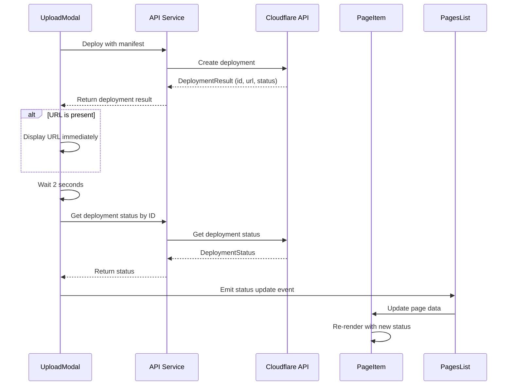

# Design Document

## Overview

This feature enhances the upload experience by providing immediate feedback when a file upload is successful and automatically updating the deployment status. The system will display the deployment URL immediately after a successful upload and then automatically check the deployment status after 2 seconds to update the PageItem UI accordingly.

## Architecture

The feature involves modifications to three main components:

1. **UploadModal Component** - Enhanced to display immediate URL feedback and handle deployment status polling
2. **PageItem Component** - Enhanced to receive and display updated deployment status
3. **API Service** - Enhanced to support deployment status polling
4. **Parent Components** - Enhanced to handle status updates and UI refresh

### Component Interaction Flow



## Components and Interfaces

### 1. UploadModal Component Enhancements

**New State Variables:**
- `deploymentUrl: ref<string | null>(null)` - Stores the immediate deployment URL
- `deploymentId: ref<string | null>(null)` - Stores the deployment ID for status polling
- `statusPollingTimer: ref<NodeJS.Timeout | null>(null)` - Timer for status polling

**New Methods:**
- `displayDeploymentUrl(url: string)` - Shows the deployment URL in the modal
- `startStatusPolling(deploymentId: string)` - Initiates 2-second delayed status check
- `checkDeploymentStatus(deploymentId: string)` - Polls deployment status API
- `updatePageStatus(status: DeploymentStatus)` - Emits status update to parent

**Enhanced Deploy Handler:**
```typescript
const handleDeploy = async () => {
  try {
    const response = await api.pages.deploy(props.page.name, manifest.value)
    
    if (response.success && response.data) {
      deploySuccess.value = true
      deploymentId.value = response.data.id
      
      // Display URL immediately if available
      if (response.data.url) {
        deploymentUrl.value = response.data.url
        displayDeploymentUrl(response.data.url)
      }
      
      // Start status polling after 2 seconds
      startStatusPolling(response.data.id)
    }
  } catch (error) {
    // Error handling
  }
}
```

### 2. PageItem Component Enhancements

**New Props Interface:**
```typescript
interface Props {
  page: Page
  // Existing props remain unchanged
}
```

**Enhanced Status Display:**
- Real-time status updates from deployment polling
- Visual indicators for deployment progress
- Updated URL display when deployment completes

### 3. API Service Enhancements

**New Method:**
```typescript
getDeploymentStatusById: (projectName: string, deploymentId: string) =>
  apiClient.get<DeploymentStatusDetail>(`/api/pages/${projectName}/deployment-status?deploymentId=${deploymentId}`)
```

### 4. Parent Component (PagesList) Enhancements

**New Event Handlers:**
- `handleStatusUpdate(pageId: string, status: DeploymentStatus)` - Updates page data in the list
- `refreshPageData(pageId: string)` - Refreshes specific page data from API

## Data Models

### Enhanced DeploymentResult Interface

The existing `DeploymentResult` interface already supports the required fields:

```typescript
interface DeploymentResult {
  id: string;                    // deployment_id for status polling
  status: DeploymentStatus;      // current deployment status
  url?: string;                  // immediate URL if available
  errorMessage?: string;         // error handling
}
```

### Enhanced Page Interface

The existing `Page` interface already supports the required fields:

```typescript
interface Page {
  id: string;
  name: string;
  status: PageStatus;
  url?: string;                  // Updated when deployment completes
  deploymentId?: string;         // Stored for future reference
  createdAt: string;
  lastDeployedAt?: string;       // Updated when deployment completes
}
```

## Error Handling

### Upload Modal Error States

1. **Deployment API Failure**
   - Display error message in modal
   - Allow retry of deployment
   - Do not start status polling

2. **Status Polling Failure**
   - Log error silently
   - Do not update UI
   - Allow manual refresh

3. **Network Connectivity Issues**
   - Show appropriate error messages
   - Provide retry mechanisms
   - Graceful degradation

### Status Polling Error Handling

```typescript
const checkDeploymentStatus = async (deploymentId: string) => {
  try {
    const response = await api.pages.getDeploymentStatusById(props.page.name, deploymentId)
    if (response.success && response.data) {
      updatePageStatus(response.data)
    }
  } catch (error) {
    // Silent failure - don't disrupt user experience
    console.warn('Failed to poll deployment status:', error)
  }
}
```

## Testing Strategy

### Unit Tests

1. **UploadModal Component Tests**
   - Test immediate URL display functionality
   - Test status polling timer setup and cleanup
   - Test deployment status update emission
   - Test error handling scenarios

2. **PageItem Component Tests**
   - Test status update rendering
   - Test URL update display
   - Test visual indicator changes

3. **API Service Tests**
   - Test deployment status polling endpoint
   - Test error handling for API failures
   - Test response data transformation

### Integration Tests

1. **Upload Flow Integration**
   - Test complete upload → deploy → status update flow
   - Test URL display and status polling coordination
   - Test parent-child component communication

2. **Error Scenario Integration**
   - Test deployment failure handling
   - Test status polling failure scenarios
   - Test network connectivity issues

### User Experience Tests

1. **Visual Feedback Tests**
   - Verify immediate URL display
   - Verify status indicator updates
   - Verify loading states and transitions

2. **Timing Tests**
   - Verify 2-second delay before status polling
   - Verify appropriate polling intervals
   - Verify cleanup of timers on component unmount

## Implementation Considerations

### Performance Optimizations

1. **Timer Management**
   - Clear timers on component unmount
   - Avoid multiple concurrent polling requests
   - Implement exponential backoff for failed requests

2. **State Management**
   - Minimize unnecessary re-renders
   - Use computed properties for derived state
   - Optimize event emission frequency

### User Experience Enhancements

1. **Visual Feedback**
   - Smooth transitions between states
   - Clear visual hierarchy for different information types
   - Accessible color schemes and indicators

2. **Progressive Enhancement**
   - Feature works without JavaScript (basic functionality)
   - Graceful degradation for API failures
   - Responsive design considerations

### Security Considerations

1. **API Security**
   - Validate deployment IDs before API calls
   - Handle authentication errors gracefully
   - Sanitize displayed URLs

2. **Client-Side Security**
   - Prevent XSS in URL display
   - Validate API responses before processing
   - Handle malformed deployment data safely